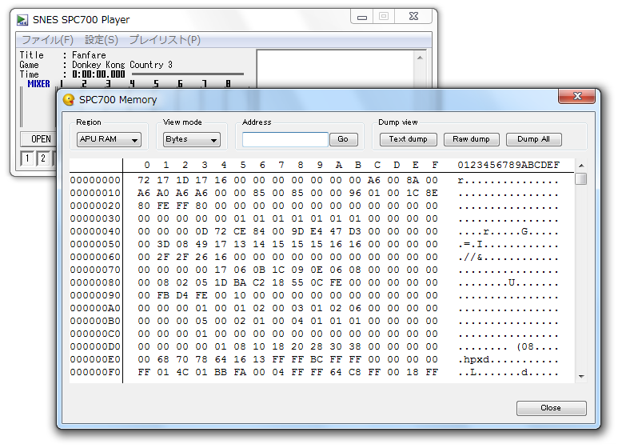

SNES SPC700 Player Memory Viewer
================================

"SNES SPC700 Player Memory Viewer" は、"SNES SPC700 Player" と併せて使用できるシンプルな設計のメモリビューアです。本ソフトウェアの特徴は以下のとおりです。

- DeSmuME の Memory Viewer をパクって独自に改良を加えたメモリビューアによって、リアルタイムなメモリ状態の表示・変更を可能にします。
- リアルタイムで APU RAM や DSP レジスタなどのメモリ状態を読み取り・書き込みすることができますので、SPC のデバッグに便利です。SNES SPC700 Player 付属の SPCCMD.EXE でも可能らしいです（問われる存在意義）
- 外部メモリビューアの仕組み上、リアルタイム表示は非常に遅い処理と考えられますが、あえて深く考慮しないことにより、アプリの早期完成・放置プレイを実現しています。
- UPX 圧縮を行わないことにより、ファイル サイズはとてもセクシーダイナマイト。各ランタイムや .NET Framework は一切不要で単体で動作しますが、SNES SPC700 Player がいないと何もできません。
- レジストリの書き込みを行わないため、アンインストールはファイルを削除するだけです。とりあえずお試しで使いたい方でも、気軽にお使いいただけます。

本ソフトウェアは以下のオペレーティング システム上で動作するよう設計されています。

- 32bit 版 Windows 2000, XP, Vista, 7
- 64bit 版 Windows Vista, 7 (※)

※ 64bit 環境では WOW64 機能により 32bit 版として動作します。(タスクマネージャで *32 が表示されます)

ダウンロード
------------

[最新版をダウンロード](https://github.com/gocha/spcmem/releases/latest)

インストール方法
----------------

SPCMEM.EXE を起動してください。

あとは [SNES SPC700 Player](http://dgrfactory.jp/) を起動すれば、何かが起こる――全米が涙した感動の話題作

アンインストール方法
--------------------

インストールしたファイルを削除してください。

レジストリの書き込みやシステム ファイルの変更などは行っていませんので、どう見てもファイルの削除のみでアンインストール完了です。本当にありがとうございました。

基本的な使い方
--------------

考えるな、感じるんだ。

お奨めの設定
------------

設定項目はありません。

詳細な説明について
------------------

周りのおともだちとかに聞いてください。『デグレファクトリー』様に問い合わせたりしたらおこだよ。

ソフトウェアについて
--------------------

このソフトウェア (SNES SPC700 Player Memory Viewer) に関するサポートは SNES SPC700 Player を開発した『デグレファクトリー』様では行われていません。

バグ報告などありましたら、下記の公開元サイト宛にお願いします。

DeSmuME からコードをパクっているので、多分ライセンスは GPL だと思います。

多分 [Github / SPCMEM](https://github.com/gocha/spcmem) で公開されるバージョンが一番新しいと思います。

SNES および Super Nintendo Entertainment System は、米国 Nintendo Co. の商標です。

### 謝辞 ###

このソフトウェアは、主に以下のファイル、または資料を使用して開発されています。貴重な資料を公開していただき、ありがとうございます。

[デグレファクトリー](http://dgrfactory.jp/)
  : SNES SPC700 Player のソースコードと README

[DeSmuME](http://desmume.org/)
  : Memory Viewer のソースコード

その他、ぐぐって出てくる情報いっぱい
  : みんなありがとう
